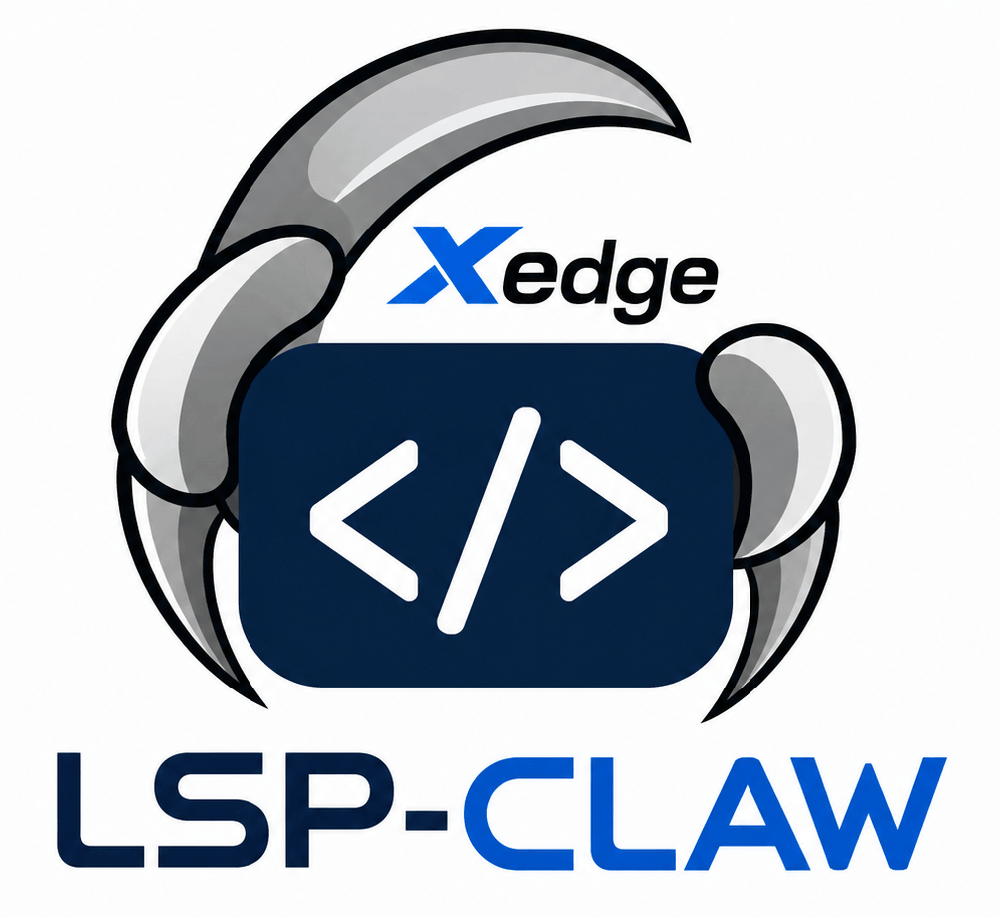
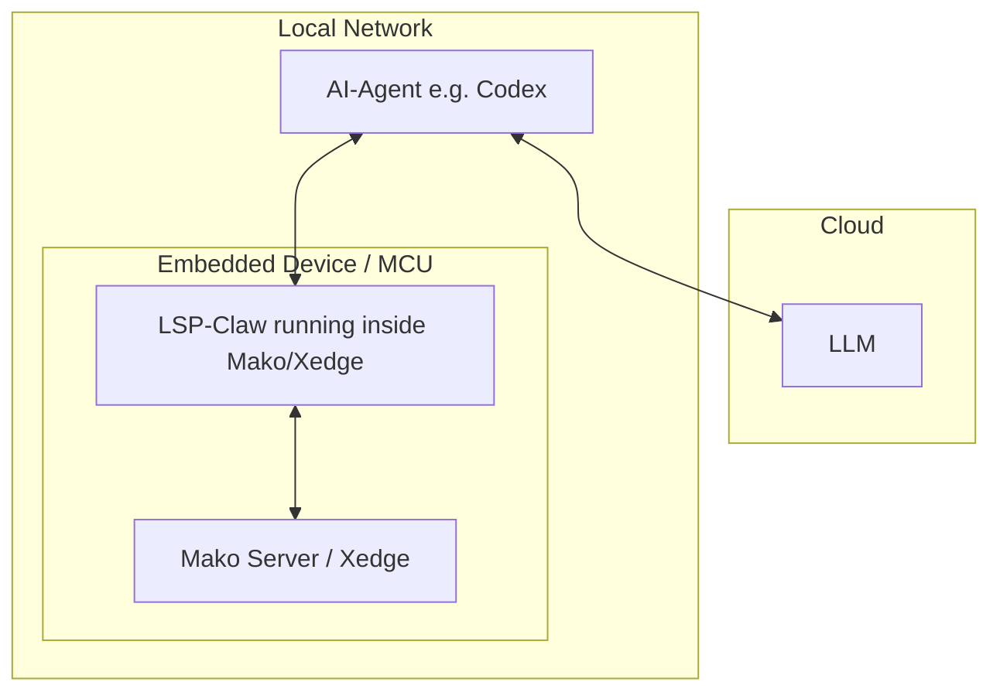

# LSP-Claw - AI-assisted Lua, LSP, IoT, and Web App Dev

LSP-Claw lets an AI-Agent work with Barracuda App Server derivative
tools such as [Mako Server](https://makoserver.net/), [Xedge](https://realtimelogic.com/products/xedge/), and [Xedge32](https://realtimelogic.com/downloads/bas/ESP32/?bas=), through an MCP
server. Instead of asking the AI-agent, such as Codex, to edit random
local files, you give it access to a controlled lab app where it can
inspect examples, create files, run the lab, and debug server-side
Lua/LSP code.



> You do not need to call MCP tools by
hand. After you configure the server in your AI-agent, you prompt the
AI-Agent normally and tell it to use LSP-Claw.

LSP-Claw is especially useful for embedded systems. LSP-Claw can remotely
start, stop, and replace the application being tested without restarting
the device, RTOS, or hosting server. A monolithic RTOS device can keep
running its core firmware while the MCP server restarts only the lab app.

## What MCP Means Here

MCP is a way for an AI-Agent (AI-Assistant) to use tools provided by another program. In
this case:

- LSP-Claw is the [MCP server](https://modelcontextprotocol.io/docs/getting-started/intro).
- LSP-Claw runs as a Lua application powered by Mako, Mako -> Xedge, or Xedge standalone (RTOS).
- Your Codex/Claude/Gemini is the AI-Agent.
- The lab is the Lua application area that the AI-Agent can inspect, edit, and run.

The following diagram illustrates how a developer can use an AI-Agent
running on a local computer to develop, test, and debug software
directly on an embedded device over the local network. The AI-Agent
communicates with a cloud-based large language model (LLM) for
reasoning and code generation, while the embedded device runs Mako
Server/Xedge with an integrated MCP server that exposes device
functionality and runtime feedback to the agent.




Once connected, the AI-Agent can ask LSP-Claw questions such as what runtime is
available, what files are in the lab, which examples may be useful, and what
trace output appeared while testing.

## Running LSP-Claw

### Using Mako with or without Xedge

When using the Mako Server, you can optionally combine LSP-Claw with Xedge. The advantage of using Xedge is that it supports executing `.xlua` files, which are small, self-contained applications that can be started or restarted automatically by the AI-Agent simply by saving or updating the file. This allows the AI-Agent to develop and test applications without restarting the entire lab application, ensuring that other `.xlua` applications running in the lab continue operating uninterrupted.

#### Command Line Examples

``` text
mako -l::LSP-Claw-zip #No Xedge, MCP URL http://localhost/mcp.lsp
mako -llsp-claw::LSP-Claw.zip #No Xedge, MCP URL http://localhost/lsp-claw/mcp.lsp
mako -l::xedge.zip -l::LSP-Claw-zip #include Xedge, MCP URL http://localhost/mcp.lsp
mako -l::xedge.zip #Only Xedge, MCP URL http://localhost/lsp-claw/mcp.lsp
```
In the last example above, LSP-Claw is not loaded when the Mako Server starts. Instead, LSP-Claw is installed as an Xedge application the first time Xedge runs. For this option, follow the same installation procedure as for standalone Xedge/RTOS deployments described below.

> See the [Mako Server Getting Started Guide](https://makoserver.net/documentation/getting-started/) for more information on installing and running the Mako Server.

### Xedge Standalone (RTOS)

When Xedge is packaged in standalone mode, which is common for RTOS deployments, LSP-Claw must be installed as an Xedge application the first time Xedge starts.

#### Installing LSP-Claw

1. Open the Xedge IDE in your browser
2. Click the menu button in the top-right corner
3. Select **App Upload**
4. Drag and drop `LSP-Claw.zip` into the uploader
5. Click **Save** without enabling unpacking

`LSP-Claw.zip` includes an [Xedge .config file](https://realtimelogic.com/articles/Mastering-Xedge-Application-Deployment-From-Installation-to-Creation) that automatically:

* Starts the application
* Configures the application base URL as:

```text
http://ip-address/lsp-claw/
```

The MCP server endpoint will therefore be:

```text
http://ip-address/lsp-claw/mcp.lsp
```

## Configure Tokens

LSP-Claw can use two optional tokens:

- `GITHUB_TOKEN`: used by LSP-Claw when accessing the
  [RealTimeLogic/LSP-Examples](https://github.com/RealTimeLogic/LSP-Examples/)
  GitHub repository. This helps avoid GitHub API rate limits. See [creating a PAT Token](https://docs.github.com/en/authentication/keeping-your-account-and-data-secure/managing-your-personal-access-tokens) for details.
- `MCP_AUTH_TOKEN`: used to protect the LSP-Claw MCP endpoint. When this token
  is configured, AI-Agents must include it when connecting to `mcp.lsp`.

The GitHub token is for outbound GitHub access only. It does not authenticate
MCP clients. The MCP authentication token is what protects the MCP server.

Both tokens are optional. If no GitHub token is configured, LSP-Claw can still
work, but GitHub access is subject to unauthenticated rate limits. If no MCP
authentication token is configured, the MCP endpoint is reachable by any client
that can connect to it.

### Mako Token Configuration

When running LSP-Claw under Mako Server, tokens can be configured with
environment variables before starting Mako:

```text
GITHUB_TOKEN=your-github-token
MCP_AUTH_TOKEN=your-mcp-auth-token
```

`GH_TOKEN` can also be used as a fallback name for the GitHub token.

For Windows command prompt:

```text
set GITHUB_TOKEN=your-github-token
set MCP_AUTH_TOKEN=your-mcp-auth-token
mako -l::LSP-Claw.zip
```

You can also configure the same values in [mako.conf](https://realtimelogic.com/ba/doc/en/Mako.html#cfgfile):

```lua
GITHUB_TOKEN="your-github-token"
MCP_AUTH_TOKEN="your-mcp-auth-token"
```

### Mako and Xedge Web Token Configuration

LSP-Claw also includes a browser setup page for configuring tokens. This is optional when using Mako Server, but **required when using Xedge standalone** if you want to set these tokens:

```text
http://localhost/index.lsp
alias:
http://localhost/
```

If LSP-Claw is installed under the packaged Xedge base URL, use:

```text
http://localhost/lsp-claw/index.lsp
```

The setup page lets you set either token, both tokens, or neither token. Leave a
field blank to store no value for that token. If an MCP authentication token is
already configured, the setup page uses that token as the login token before it
shows the token form.

Tokens saved through LSP-Claw are stored encrypted using key material derived
from the host/device. This is the preferred method for Xedge standalone systems
and is also useful for Mako deployments where you do not want long-lived tokens
kept in plain text configuration files.

## Configure Your AI-Agent

> In the following examples, the MCP URL assumes that LSP-Claw is running as a root application. However, if you plan to develop web applications, you should configure a dedicated base URL [as explained above](#running-lsp-claw) to avoid URL conflicts with the lab app, which also runs as a root app. Also note that when LSP-Claw is installed as a packaged Xedge application, the MCP server URL becomes: `http://ip-address/lsp-claw/mcp.lsp`


First make sure the LSP-Claw server is running and reachable from the machine
running your AI-Agent. The default endpoint, when LSP-Claw runs as a root application, is:

```text
http://localhost/mcp.lsp
```

If LSP-Claw is running on another machine, replace `localhost` with that host
name or IP address.

Start the LSP-Claw MCP server before starting the AI-Agent or opening a new AI
session. Most AI-Agents discover MCP tools only at startup, so a server that is
started later may not become visible until the AI-Agent is restarted.

Every AI-Agent has its own configuration format. As one concrete example, in
Codex you can add the server to your Codex `config.toml` file. Common locations
are:

### Codex Example

```text
Windows: C:\Users\<you>\.codex\config.toml
```

Add this section. If you already have an MCP server entry for this same URL,
you can reuse that entry instead of adding a duplicate.

```toml
[mcp_servers.lsp_claw]
url = "http://localhost/mcp.lsp"
enabled = true
startup_timeout_sec = 10
tool_timeout_sec = 30
```

If LSP-Claw is configured with `MCP_AUTH_TOKEN`, add a bearer token environment
variable to the same server entry:

```toml
[mcp_servers.lsp_claw]
url = "http://localhost/mcp.lsp"
enabled = true
startup_timeout_sec = 10
tool_timeout_sec = 30
bearer_token_env_var = "LSP_CLAW_MCP_TOKEN"
```

Then set `LSP_CLAW_MCP_TOKEN` to the same value as the LSP-Claw
`MCP_AUTH_TOKEN` before starting Codex.

For a remote server, use the remote URL instead:

```toml
url = "http://192.168.1.50/mcp.lsp"
```

Restart the AI-Agent after changing its config, or start a new session so it
loads the new MCP server.

To verify the connection, ask the AI-Agent:

```text
Use the LSP-Claw MCP server. Check the runtime and lab status, then tell me
what you found. Do not change any files yet.
```

If the AI-Agent reports the runtime and lab status, the MCP server is
available.

## First Useful Prompt

A useful first prompt should tell the AI-Agent what you want, where it should
work, and how careful it should be with existing lab files.

- What you want to build.
- Whether to target Mako or Xedge, or ask it to check first.
- Whether to start from an example or from a blank lab app.
- How it should test the result.
- Whether it may overwrite existing lab files.

Starter prompt:

```text
Use LSP-Claw. First check whether the lab is running on Mako or Xedge and see
what files are already in the lab. Build in the lab app, not in my local
workspace. If the lab already contains files, stop and tell me what is there
before changing anything. Start the lab and test the page when you are done.
```

## Start from an Example

When you ask the AI-Agent to build something with LSP-Claw, you can choose one
of two paths:

- Start from an existing example in the
  [RealTimeLogic/LSP-Examples](https://github.com/RealTimeLogic/LSP-Examples/)
  GitHub repo.
- Create a new lab app from scratch.

Starting from an example is useful when your goal resembles an existing pattern,
such as a dashboard, form, AJAX endpoint, REST API, WebSocket app, or SMQ app.
The AI-Agent can look through the examples, recommend a starting point, and copy
only the part that should run in the lab.

```text
Use LSP-Claw to find a good starting example for a small browser UI that
controls a device setting. Tell me which example you recommend and why. Do not
copy anything until you have checked whether the lab already contains files.
```

The suggested example may not always be the best fit. Use critical thinking and
ask the AI-Agent to explain why an example is a good starting point before it
copies anything.

Examples are accelerators, not a requirement. If your request is already small
and specific, such as a single form or one JSON endpoint, it may be clearer to
build from scratch.

For larger work, it can also help to keep a local project directory
with the
[Barracuda App Server's AGENTS.md](https://github.com/RealTimeLogic/LSP-Examples/blob/master/AGENTS.md)
file. This gives the AI-Agent stable project guidance while LSP-Claw
handles the running lab app.

After the AI-Agent recommends an example, you can continue with:

```text
Before copying, check whether the lab contains files. If it does, stop and tell
me the conflict options. Do not delete or overwrite anything unless I explicitly
confirm. If there is no conflict, copy the recommended example into the lab,
start it, test the main page, and summarize what files were added.
```

## Build a Small LSP Page

Use this when you already know what you want and do not need an example.

```text
Use LSP-Claw to build a new Mako-compatible lab app from scratch. Create a
single index.lsp page that shows a hit counter. Keep it small and compatible
with BAS/Lua. Start the lab, open the page, and fix any server-side errors.
```

Useful LSP basics:

```text
Use <?lsp ?> for Lua code.
Use <?lsp= ?> for expression output.
Keep the first version small and dependency-free.
```

For simple tutorial-sized apps, this direct approach is often better than
starting from a larger example.

## HTML Form Tutorial

This pattern is the easiest way to understand browser-to-server interaction:
the browser submits a normal form, and the LSP page handles the request.

```text
Build a Mako lab app with index.lsp containing an HTML form for a simulated LED.
On GET, show the current LED state. On POST, read the submitted form value and
update the state. Start the lab and test both turning the LED on and off.
```

If something does not work, ask the AI-Agent to debug it:

```text
The form is loading, but the state is not changing. Use LSP-Claw trace output
to find the problem, fix it, and remove any temporary debug output before
finishing.
```

## Fetch/AJAX Tutorial

Use this when you want the page to update without a full browser reload.

```text
Build a Mako lab app with index.html and api.lsp. The page should use fetch()
to call api.lsp and update a status panel without reloading. api.lsp should
return JSON. Include a button that toggles a simulated relay. Start the lab and
test the button.
```

Good constraints to include:

```text
Keep the JavaScript small and dependency-free.
Validate request data on the server.
Return clear JSON with ok, state, and error fields.
```

## Small REST API Tutorial

Use this when the AI-Agent is another program, a test script, or a device.
LSP-Examples already includes a REST example with a reusable Lua router module
named `rest.lua`, so start there instead of building a router from scratch.

```text
Use LSP-Claw to build a small REST API based on the REST example. If the lab
already contains files, stop and ask before copying anything. Start the lab and
test:

- GET /api/users
- POST /api/users with a JSON body containing name and email
- GET /api/users/{id}
- PUT /api/users/{id} with a JSON body containing name and email
- DELETE /api/users/{id}
Return JSON and appropriate HTTP status codes.
```

If you want to adapt the example:

```text
Use the REST example as the base. Add the routes I need, keep the router code
reusable, and retest the API after each change.
```

## Timer-Driven Status Page

Use this for background status updates, simulated sensor readings, or periodic
maintenance.

```text
Create a lab app with .preload and index.lsp. In .preload, start a timer that
updates a simulated temperature value once per second. index.lsp should display
the latest value. Start the lab and confirm the value changes over time.
```

Important constraint:

```text
Do not create a busy loop. Use the runtime's timer pattern for repeated work.
```

## Real-Time Browser Updates

For dashboards or live device status, ask the AI-Agent to compare the available
options before it starts changing files.

```text
I want a small real-time dashboard that shows a simulated sensor value updating
once per second. Use LSP-Claw to inspect examples that use WebSockets or SMQ,
then recommend whether to start from an example or build a simpler app from
scratch. Explain your recommendation before copying anything.
```

If you want an example-based result:

```text
Find a RealTimeLogic/LSP-Examples project suitable for real-time browser
updates using SMQ or WebSockets. Recommend a starting point, then ask me before
copying if the lab already contains files.
```

## Debugging

When the app does not behave correctly, the most useful feedback is the server
trace output. Ask the AI-Agent to use it directly:

```text
The app is not behaving correctly. Use LSP-Claw trace output to debug it.
Add temporary trace messages only if they help. Run the page again, inspect the
trace output, fix the bug, and remove temporary traces that are no longer useful.
```

Do not ask the AI-Agent to trace sensitive data such as:

- Tokens or passwords.
- Authorization headers or cookies.
- Large request bodies.
- Private user data.

## Remote Server Usage

If LSP-Claw is running on another machine, make that explicit in the prompt.
This prevents the AI-Agent from assuming it can use local filesystem paths or
a local console.

```text
The LSP-Claw MCP server is running on a remote BAS host. Use only LSP-Claw MCP
tools to inspect, modify, run, and debug the lab app. Do not assume you can use
local files from my computer. Check the lab first, make the requested changes,
start the lab, and use trace output for debugging.
```

## Finishing Checklist

Ask the AI-Agent to finish with a short report:

```text
When finished, summarize:
- Files created or changed.
- Runtime detected.
- How you tested the app.
- Any trace findings that mattered.
- Any remaining limitations.
- Whether temporary debug traces were removed or intentionally kept.
```

Example final report:

```text
Created tutorial-tests/form.lsp and tutorial-tests/api.lsp.
Detected runtime: Mako.
Tested GET and POST requests through the running lab.
Trace output showed no Lua exceptions.
Temporary debug traces were removed.
Remaining limitation: state is in memory and resets when the lab restarts.
```

## Troubleshooting Setup

If your AI-Agent cannot see LSP-Claw:

- Confirm the LSP-Claw server is running.
- Check that `http://localhost/mcp.lsp` is reachable from the same machine
  running the AI-Agent, or use the remote host URL if the server is not local.
  It may not render a normal web page; the important part is that the server
  responds. A `204 No Content` response is still a valid sign that the endpoint
  is alive.
- Confirm the server entry is present in your AI-Agent configuration. For the
  Codex example above, that is the `[mcp_servers.lsp_claw]` section in your
  `.codex/config.toml` file.
- Start the LSP-Claw MCP server before starting the AI-Agent.
- Restart the AI-Agent after editing the config or after starting a server that
  was not running when the AI-Agent first opened.
- Ask the AI-Agent to check the runtime and lab status before asking it to
  build anything.

If the endpoint responds but the AI-Agent still cannot see LSP-Claw tools, the
AI-Agent probably discovered its MCP servers before LSP-Claw was available.
Restart the AI-Agent or open a new session.
