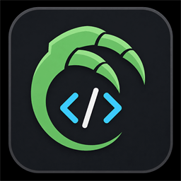
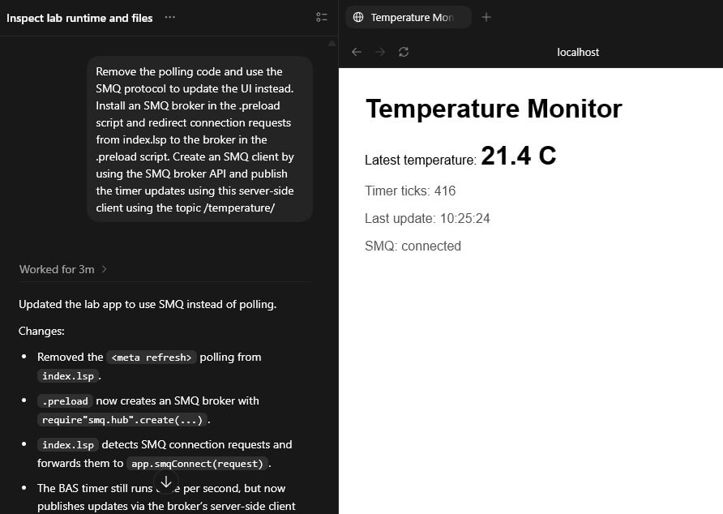

# LSP-Claw - AI-Assisted Lua, LSP, IoT, and Web App Development

LSP-Claw lets an AI agent work with Barracuda App Server (**BAS**) based
tools such as [Mako Server](https://makoserver.net/),
[Xedge](https://realtimelogic.com/products/xedge/), and
[Xedge32](https://realtimelogic.com/downloads/bas/ESP32/?bas=) through an
MCP server. Instead of asking an AI agent, such as Codex, to edit random
local files, you give it access to a controlled lab app where it can
inspect examples, create files, run the lab, and debug server-side
Lua/LSP code.



LSP-Claw is especially useful for embedded systems. LSP-Claw can remotely
start, stop, and replace the application being tested without restarting
the device, RTOS, or hosting server. A monolithic RTOS device can keep
running its core firmware while the MCP server restarts only the lab app.

## What MCP Means Here

MCP lets an AI agent use tools provided by another program. In this case:

- LSP-Claw is the [MCP server](https://modelcontextprotocol.io/docs/getting-started/intro).
- LSP-Claw runs as a Lua application powered by Mako, Mako with Xedge, or
  standalone Xedge on an RTOS.
- Codex, Claude Code, Google Antigravity, or another assistant is the AI agent.
- The lab is the Lua application area that the AI agent can inspect, edit, and
  run.

The following diagram illustrates how a developer can use an AI agent
running on a local computer to develop, test, and debug software
directly on an embedded device over the local network. The AI agent
communicates with a cloud-based large language model (LLM) for
reasoning and code generation, while the embedded device runs Mako
Server/Xedge with an integrated MCP server that exposes device
functionality and runtime feedback to the agent.


Once connected, the AI agent can ask LSP-Claw questions such as what runtime is
available, what files are in the lab, which examples may be useful, and what
trace output appeared while testing.

The following screenshot shows part of the Codex AI agent's user
interface when running the [SMQ example prompt](#using-smq-websockets) in this tutorial. Codex
not only created the web-app, but also tested it. The embedded Codex
browser can be used to manually test the UI.




## Running LSP-Claw

### Using Mako with or without Xedge

When using Mako Server, you can optionally combine LSP-Claw with Xedge. Xedge
supports executing `.xlua` files, which are small, self-contained applications
that can be started or restarted automatically when the AI agent saves or
updates the file. This lets the AI agent develop and test applications without
restarting the entire lab application, so other `.xlua` applications running in
the lab can continue uninterrupted.

#### Command Line Examples

```text
mako -l::LSP-Claw.zip # No Xedge, MCP URL http://localhost/mcp.lsp
mako -llsp-claw::LSP-Claw.zip # No Xedge, MCP URL http://localhost/lsp-claw/mcp.lsp
mako -l::xedge.zip -l::LSP-Claw.zip # Include Xedge, MCP URL http://localhost/mcp.lsp
mako -l::xedge.zip # Only Xedge, MCP URL http://localhost/lsp-claw/mcp.lsp
```

In the last example, LSP-Claw is not loaded when Mako Server starts. Instead,
LSP-Claw is installed as an Xedge application the first time Xedge runs. For
this option, follow the same installation procedure used for the standalone
Xedge/RTOS deployment described below.

> See the [Mako Server Getting Started Guide](https://makoserver.net/documentation/getting-started/)
> for more information on installing and running Mako Server.

### Xedge Standalone (RTOS)

When Xedge is packaged in standalone mode, which is common for RTOS deployments,
LSP-Claw must be installed as an Xedge application the first time Xedge starts.

#### Installing LSP-Claw

1. Open the Xedge IDE in your browser.
2. Click the menu button in the top-right corner.
3. Select **App Upload**.
4. Drag and drop `LSP-Claw.zip` into the uploader.
5. Click **Save** without enabling unpacking.

`LSP-Claw.zip` includes an
[Xedge .config file](https://realtimelogic.com/articles/Mastering-Xedge-Application-Deployment-From-Installation-to-Creation)
that automatically:

- Starts the application.
- Configures the application base URL as:

```text
http://ip-address/lsp-claw/
```

The MCP server endpoint will therefore be:

```text
http://ip-address/lsp-claw/mcp.lsp
```

## Configure Tokens

LSP-Claw can use two optional tokens:

- `GITHUB_TOKEN`: used by LSP-Claw when accessing the
  [RealTimeLogic/LSP-Examples](https://github.com/RealTimeLogic/LSP-Examples/)
  GitHub repository. This helps avoid GitHub API rate limits. See
  [creating a personal access token](https://docs.github.com/en/authentication/keeping-your-account-and-data-secure/managing-your-personal-access-tokens)
  for details.
- `MCP_AUTH_TOKEN`: used to protect the LSP-Claw MCP endpoint. When this token
  is configured, AI agents must include it when connecting to `mcp.lsp`.

The GitHub token is for outbound GitHub access only. It does not authenticate
MCP clients. The MCP authentication token is what protects the MCP server.

Both tokens are optional. If no GitHub token is configured, LSP-Claw can still
work, but GitHub access is subject to unauthenticated rate limits. If no MCP
authentication token is configured, the MCP endpoint is reachable by any client
that can connect to it.

### Mako Token Configuration

When running LSP-Claw under Mako Server, tokens can be configured with
environment variables before starting Mako:

```text
GITHUB_TOKEN=your-github-token
MCP_AUTH_TOKEN=your-mcp-auth-token
```

`GH_TOKEN` can also be used as a fallback name for the GitHub token.

For Windows command prompt:

```text
set GITHUB_TOKEN=your-github-token
set MCP_AUTH_TOKEN=your-mcp-auth-token
mako -l::LSP-Claw.zip
```

You can also configure the same values in
[mako.conf](https://realtimelogic.com/ba/doc/en/Mako.html#cfgfile):

```lua
GITHUB_TOKEN="your-github-token"
MCP_AUTH_TOKEN="your-mcp-auth-token"
```

### Web Token Configuration for Mako and Xedge

LSP-Claw also includes a browser setup page for configuring tokens. This is
optional when using Mako Server, but **required when using standalone Xedge** if
you want to set these tokens:

```text
http://localhost/
alias:
http://localhost/index.lsp
```

If LSP-Claw is installed under the packaged Xedge base URL, use:

```text
http://localhost/lsp-claw/index.lsp
```

The setup page lets you set either token, both tokens, or neither token. Leave a
field blank to store no value for that token. If an MCP authentication token is
already configured, the setup page uses that token as the login token before it
shows the token form.

Tokens saved through LSP-Claw are stored encrypted using key material derived
from the host/device. This is the preferred method for Xedge standalone systems
and is also useful for Mako deployments where you do not want long-lived tokens
kept in plain text configuration files.

## Configure Your AI Agent

> In the following examples, the MCP URL assumes that LSP-Claw is running as a
> root application. If you plan to develop web applications, configure a
> dedicated base URL [as explained above](#running-lsp-claw) to avoid URL
> conflicts with the lab app, which also runs as a root app. When LSP-Claw is
> installed as a packaged Xedge application, the MCP server URL is:
> `http://ip-address/lsp-claw/mcp.lsp`.


First make sure the LSP-Claw server is running and reachable from the machine
running your AI agent. When LSP-Claw runs as a root application, the default
endpoint is:

```text
http://localhost/mcp.lsp
```

If LSP-Claw is running on another machine, replace `localhost` with that host
name or IP address.

Start the LSP-Claw MCP server before starting the AI agent or opening a new AI
session. Most AI agents discover MCP tools only at startup, so a server that is
started later may not become visible until the AI agent is restarted.

Every AI agent has its own configuration format. As one concrete example, in
Codex you can add the server to your Codex `config.toml` file. Common locations
are:

### Codex Example

```text
Windows: C:\Users\<you>\.codex\config.toml
```

Add this section. If you already have an MCP server entry for this same URL,
you can reuse that entry instead of adding a duplicate.

```toml
[mcp_servers.lsp_claw]
url = "http://localhost/mcp.lsp"
enabled = true
startup_timeout_sec = 10
tool_timeout_sec = 30
```

If LSP-Claw is configured with `MCP_AUTH_TOKEN`, add a bearer token environment
variable to the same server entry:

```toml
[mcp_servers.lsp_claw]
url = "http://localhost/mcp.lsp"
enabled = true
startup_timeout_sec = 10
tool_timeout_sec = 30
bearer_token_env_var = "LSP_CLAW_MCP_TOKEN"
```

Then set `LSP_CLAW_MCP_TOKEN` to the same value as the LSP-Claw
`MCP_AUTH_TOKEN` before starting Codex.

For a remote server, use the remote URL instead:

```toml
url = "http://192.168.1.50/mcp.lsp"
```

Restart the AI agent after changing its config, or start a new session so it
loads the new MCP server.

To verify the connection, ask the AI agent:

```text
Use the LSP-Claw MCP server. Check the runtime and lab status, then tell me
what you found. Do not change any files yet.
```

If the AI agent reports the runtime and lab status, the MCP server is
available.

## First Useful Prompt

A useful first prompt should tell the AI agent what you want, where it should
work, and how careful it should be with existing lab files.

- What you want to build.
- Whether to target Mako or Xedge, or ask it to check first.
- Whether to start from an example or from a blank lab app.
- How it should test the result.
- Whether it may overwrite existing lab files.

### Starter Prompt

```text
Use LSP-Claw. First, check whether the lab is running on Mako or
Xedge, and see what files are already in the lab. Build in the lab
app, not in my local workspace, and do not use my local workspace
unless I specifically tell you to.
```

The following prompt requires Xedge. It checks whether the AI agent can write a
simple example and inspect the printed results.

```text
Create a simple .xlua file that sets up a timer to print a message
every second for 5 seconds, then executes it. Inspect the printed
output and tell me what it is.
```

## Start from an Example

When you ask the AI agent to build something with LSP-Claw, you can choose one
of two paths:

- Start from an existing example in the
  [RealTimeLogic/LSP-Examples](https://github.com/RealTimeLogic/LSP-Examples/)
  GitHub repo.
- Create a new lab app from scratch.

Starting from an example is useful when your goal resembles an existing pattern,
such as a dashboard, form, AJAX endpoint, REST API, WebSocket app, or SMQ app.
The AI agent can look through the examples, recommend a starting point, and copy
only the part that should run in the lab.

```text
Use LSP-Claw to find a good starting example for a small browser UI that
controls a device setting. Tell me which example you recommend and why. Do not
copy anything until you have checked whether the lab already contains files.
```

The suggested example may not always be the best fit. Use critical thinking and
ask the AI agent to explain why an example is a good starting point before it
copies anything.

Examples are accelerators, not a requirement. If your request is already small
and specific, such as a single form or one JSON endpoint, it may be clearer to
build from scratch.

For larger work, it can also help to keep a local project directory with the
[Barracuda App Server's AGENTS.md](https://github.com/RealTimeLogic/LSP-Examples/blob/master/AGENTS.md)
file. This gives the AI agent stable project guidance while LSP-Claw handles the
running lab app.

After the AI agent recommends an example, you can continue with:

```text
Back up the existing lab and clean the lab
```

You can also ask it to clean all files or copy new files without deleting the
current lab.

## Build a Small LSP Page

Use this when you already know what you want and do not need an example.

```text
Use LSP-Claw to build a new LSP app from scratch. Create a
single index.lsp page that shows a hit counter. Keep it small and compatible
with BAS/Lua. Start the lab, open the page, and fix any server-side errors.
Tell me how to navigate to it.
```

For simple tutorial-sized apps, this direct approach is often better than
starting from a larger example.

For this example, the application URL is `http://localhost/`.

If you are running standalone Xedge or Xedge through Mako Server, navigate to
`http://localhost/rtl/` to open Xedge. Expand the `$lsplab` app and click
`index.lsp` to view the code. The Xedge UI running in the browser is unaware of
server-side changes, so refresh it to see changes made by LSP-Claw.

## HTML Form Tutorial

This pattern is the easiest way to understand browser-to-server interaction:
the browser submits a normal form, and the LSP page handles the request.

```text
Clear the lab and build an LSP app with index.lsp containing an HTML
form for a simulated LED. On GET, show the current LED state. On
POST, read the submitted form value and update the state. On the
server side, print the status with trace(). Start the lab
and test both turning the LED on and off.
```

The AI agent should automatically test the app. If something does not work, ask
the AI agent to debug it:

```text
The form is loading, but the state is not changing. Use LSP-Claw trace
output to find the problem by instrumenting the code, fix it, and
remove any temporary debug output before finishing.
```

If you are new to LSP, open the file and study the design. The AI agent should
create a standard server-rendered page with a submit button. You can then ask
the AI agent to use JavaScript instead.

### AJAX Example

```text
In index.lsp, remove the submit button and update the UI to use
JavaScript to automatically send the state to the server when the user
clicks the UI.
```

### GPIO Example

If you are running LSP-Claw on an **ESP32** using
[Xedge32](https://realtimelogic.com/downloads/bas/ESP32/?bas=), try the
following prompt.

```text
I have an LED connected to GPIO 1. In index.lsp, use the ESP32 GPIO
API to turn the LED on and off when the user clicks the UI.
```

## Small REST API Tutorial

The [GitHub repo includes a REST module](https://github.com/RealTimeLogic/LSP-Examples/tree/master/REST).
The following prompt should download and use this module.

```text
Back up and clear the lab.
Use LSP-Claw to build a small REST API based on the REST example and
the REST module. If the lab already contains files, stop and ask
before copying anything. Start the lab and test:
- GET /api/users
- POST /api/users with a JSON body containing name and email
- GET /api/users/{id}
- PUT /api/users/{id} with a JSON body containing name and email
- DELETE /api/users/{id}
Return JSON and appropriate HTTP status codes.
Create an index.html using the fetch API to test the REST API.
```

## Timer-Driven Status Page

Use this for background status updates, simulated sensor readings, or periodic
maintenance.

```text
Back up and clear the lab.
Create a lab app with .preload and index.lsp. In .preload, start a timer that
updates a simulated temperature value once per second. index.lsp should display
the latest value. Start the lab and confirm the value changes over time.

Important constraint:

Do not create a busy loop. Use the BAS timer API for repeated work.
```

### Using SMQ WebSockets

When we tested the above prompt, the AI agent created an `index.lsp` page that
polled the server for updates with `<meta http-equiv="refresh" content="2">`.

You can update the code to use WebSockets instead, but an even better solution
is to use the [SMQ protocol](https://realtimelogic.com/ba/doc/en/SMQ.html).

```text
Remove the polling code and use the SMQ protocol to update the UI
instead. Install an SMQ broker in the .preload script and redirect
connection requests from index.lsp to the broker in the .preload
script. Create an SMQ client using the SMQ broker API and publish
the timer updates from this server-side client using the topic
/temperature/
```

## Real-Time Browser Updates

For dashboards or live device status, ask the AI agent to compare the available
options before it starts changing files.

```text
I want a small real-time dashboard that shows a simulated sensor value updating
once per second. Use LSP-Claw to inspect examples that use WebSockets or SMQ,
then recommend whether to start from an example or build a simpler app from
scratch. Explain your recommendation before copying anything.
```

## Debugging

When the app does not behave correctly, the most useful feedback is the server
trace output. Ask the AI agent to use it directly:

```text
The app is not behaving correctly. Use BAS trace output to debug it.
Add temporary trace messages only if they help. Run the page again, inspect the
trace output, fix the bug, and remove temporary traces that are no longer useful.
```

Do not ask the AI agent to trace sensitive data such as:

- Tokens or passwords.
- Authorization headers or cookies.
- Large request bodies.
- Private user data.

## Remote Server Usage

If LSP-Claw is running on another machine, make that explicit in the prompt.
This prevents the AI agent from assuming it can use local filesystem paths or
a local console.

```text
The LSP-Claw MCP server is running on a remote BAS host. Use only LSP-Claw MCP
tools to inspect, modify, run, and debug the lab app. Do not assume you can use
local files from my computer. Check the lab first, make the requested changes,
start the lab, and use trace output for debugging.
```

## Finishing Checklist

Ask the AI agent to finish with a short report:

```text
When finished, summarize:
- Files created or changed.
- Runtime detected.
- How you tested the app.
- Any trace findings that mattered.
- Any remaining limitations.
- Whether temporary debug traces were removed or intentionally kept.
```

## Troubleshooting Setup

If your AI agent cannot see LSP-Claw:

- Confirm the LSP-Claw server is running.
- Check that `http://localhost/mcp.lsp` is reachable from the same machine
  running the AI agent, or use the remote host URL if the server is not local.
  It may not render a normal web page; the important part is that the server
  responds. A `204 No Content` response is still a valid sign that the endpoint
  is alive.
- Confirm the server entry is present in your AI agent configuration. For the
  Codex example above, that is the `[mcp_servers.lsp_claw]` section in your
  `.codex/config.toml` file.
- Start the LSP-Claw MCP server before starting the AI agent.
- Restart the AI agent after editing the config or after starting a server that
  was not running when the AI agent first opened.
- Ask the AI agent to check the runtime and lab status before asking it to
  build anything.

If the endpoint responds but the AI agent still cannot see LSP-Claw tools, the
AI agent probably discovered its MCP servers before LSP-Claw was available.
Restart the AI agent or open a new session.
